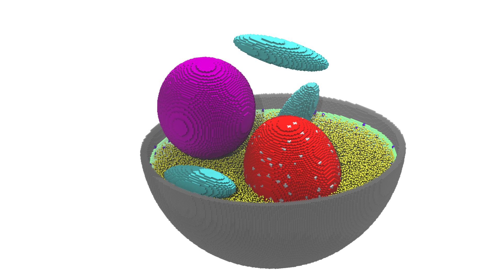

# Hi there, I'm Tianyu Wu 👋

## About Me

I am a Biophysics Graduate Student at University of Illinois, Urbana-Champaign, with a focus on Whole Cell Modeling(WCM). My work primarily revolves around building up a WCM for _S. Cerevisiae_. I am passionate about System biology and GPU programming.

- 🌱 I’m currently working on _S. Cerevisiae_ .
- 👯 I’m looking to collaborate on WCM or other nonlinear dynamics system.
- 📫 How to reach me: tianyu16 at illinois.edu
- ⚡ Fun fact: [A Fun Fact About You]

<!-- ## Research Interests

- [Interest 1]
- [Interest 2]
- [Interest 3]
- [Interest 4] -->

## Education

- **Bachelor** in Physics, PKU, 2023

<!-- ## Publications -->

<!-- 1. **[Title of Paper 1]**  
   _[Authors]_  
   [Journal/Conference], [Year].  
   [DOI/Link to Paper]

2. **[Title of Paper 2]**  
   _[Authors]_  
   [Journal/Conference], [Year].  
   [DOI/Link to Paper]

3. **[Title of Paper 3]**  
   _[Authors]_  
   [Journal/Conference], [Year].  
   [DOI/Link to Paper] -->

_For a complete list of publications, please visit my [Google Scholar Profile](https://scholar.google.com/citations?user=YOURSCHOLARID)_

<!-- ## Projects

### [Project Title 1]
**Description:** [Brief Description of the Project]  
**Repository:** [Link to Repository]  
**Technologies:** [List of Technologies Used]

### [Project Title 2]
**Description:** [Brief Description of the Project]  
**Repository:** [Link to Repository]  
**Technologies:** [List of Technologies Used]

### [Project Title 3]
**Description:** [Brief Description of the Project]  
**Repository:** [Link to Repository]  
**Technologies:** [List of Technologies Used] -->

<!-- ## Professional Experience

- **[Your Position]**  
  _[Company/Institution], [Location]_  
  [Start Date] - [End Date]  
  - Responsibility 1
  - Responsibility 2
  - Responsibility 3

- **[Your Position]**  
  _[Company/Institution], [Location]_  
  [Start Date] - [End Date]  
  - Responsibility 1
  - Responsibility 2
  - Responsibility 3 -->

## Skills

- **Programming Languages:** python, C++, cuda
<!-- - **Tools and Technologies:** [Tool 1], [Tool 2], [Tool 3]
- **Methodologies:** [Methodology 1], [Methodology 2], [Methodology 3] -->

<!-- ## Contact

- **Email:** [Your Email]
- **LinkedIn:** [Your LinkedIn Profile](https://www.linkedin.com/in/YOURPROFILE)
- **Twitter:** [Your Twitter Profile](https://twitter.com/YOURPROFILE)
- **Website:** [Your Personal Website](https://yourwebsite.com) -->

<!-- ## GitHub Stats

## Recent Activity

<!--START_SECTION:activity-->
1. 💬 Commented on [Issue Title](https://github.com/repository/issues/issue-number) in [Repository](https://github.com/repository)
2. 🎉 Merged PR [#PR-Number](https://github.com/repository/pull/PR-Number) in [Repository](https://github.com/repository)
3. ❗️ Closed issue [#Issue-Number](https://github.com/repository/issues/Issue-Number) in [Repository](https://github.com/repository)
4. 💪 Opened PR [#PR-Number](https://github.com/repository/pull/PR-Number) in [Repository](https://github.com/repository) -->
<!--END_SECTION:activity-->

Thank you for visiting my GitHub profile! Feel free to reach out if you have any questions or would like to collaborate on a project.
