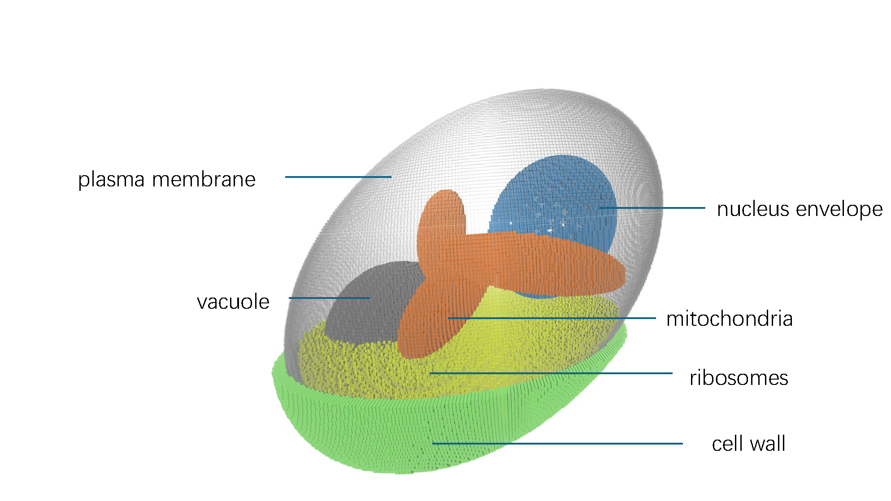

# Hi there, I'm Tianyu Wu

## About Me

I am a Ph.D. candidate in Biophysics and Quantitative Biology at the University of Illinois at Urbana-Champaign (UIUC), focusing on Whole-Cell Modeling (WCM). My current research involves developing comprehensive computational models of the metabolic networks in baker's yeast (_Saccharomyces cerevisiae_), leveraging GPU parallel programming techniques. I am passionate about systems biology, computational modeling, and exploring nonlinear dynamics through interdisciplinary collaborations.

- 🌱 I'm currently working on whole-cell metabolic modeling of _S. cerevisiae_.
- 👯 I'm looking to collaborate on projects related to WCM, computational biophysics, or nonlinear dynamic systems.
- 📫 How to reach me: [tianyu16@illinois.edu](mailto:tianyu16@illinois.edu)
- ⚡ Fun fact: I enjoy visualizing biological structures through creative tools like Minecraft or Blender!

## Education

- **Ph.D. in Biophysics and Quantitative Biology**, University of Illinois at Urbana-Champaign (UIUC), 2023 – Present
- **Bachelor of Science in Biophysics (Dual Degree: Management)**, Peking University, 2022

## Research Interests

- Whole-cell computational modeling
- Systems biology and metabolic network analysis
- GPU programming and computational optimizations
- AI-assisted virtual cell modeling

## Publications

1. **Wu T**, Thornburg ZR, Tan K, et al. "Visualizing Cell Structures with Minecraft." *The Biophysicist*. February 03, 2025. [doi: 10.35459/tbp.2024.000275](https://doi.org/10.35459/tbp.2024.000275)
2. **Wu T**, et al. "Spatially-resolved stochastic simulation of the galactose regulatory network in *S. cerevisiae* via RDME-ODE hybrid method." *Journal of Physical Chemistry B* (In preparation)

## Skills

- **Programming Languages:** Python, C++, CUDA, MATLAB
- **Tools and Software:** AlphaFold2/3, Lattice Microbes, VMD, PyMOL, IMOD, ImageJ, Blender, Minecraft
- **Methodologies:** Whole-cell modeling, stochastic simulations, multi-scale modeling, bioinformatics

Thank you for visiting my profile! Feel free to reach out if you have questions or are interested in collaborating.
